- # Reto UI-UX
 ## Objetivo

Identifica los elementos de navegación en los siguientes sites:

- Breather
- Github
- Medium

1.-***Breather:***
- ### Navegación filtrada

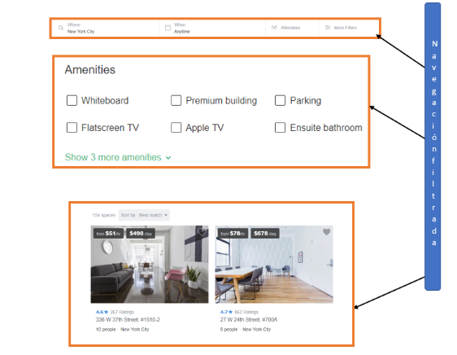

- ### Navegación Global

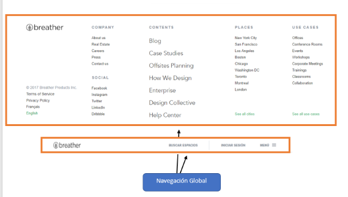

- ### Navegación Facetada

***

2.-***Github:***

- ### Navegación filtrada 

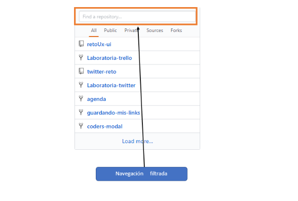

- ### Navegación Global

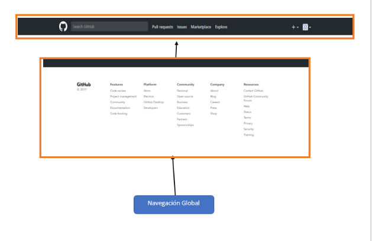

- ### Navegación facetada

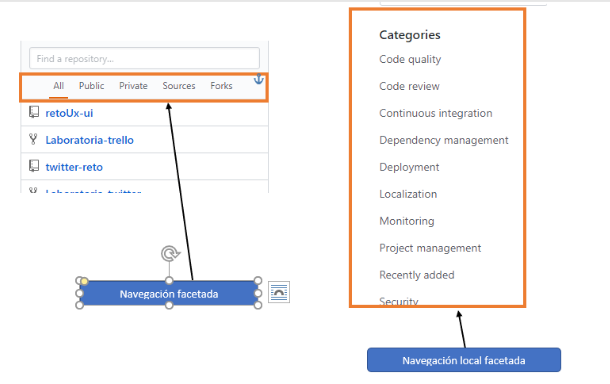

- ### Navegación local

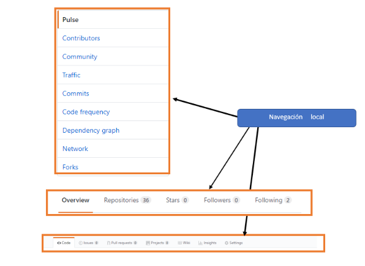

***

3.-***Medium***

- ### Navegación local

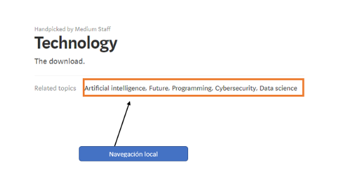

- ### Navegación Global

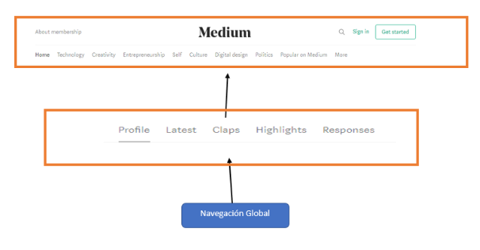

- ### Navegación Inline

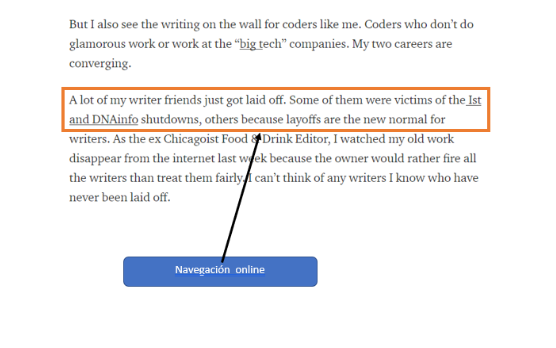

- ### Navegación contextual

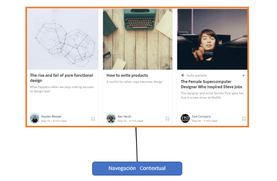

- ### Navegación suplementaria

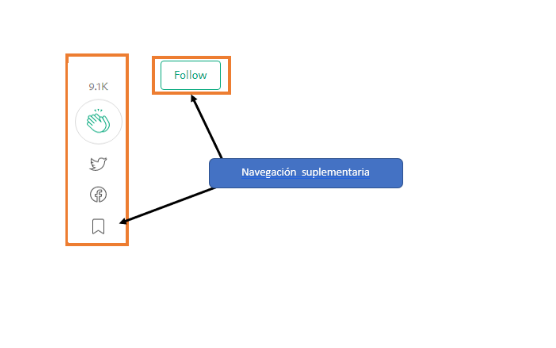